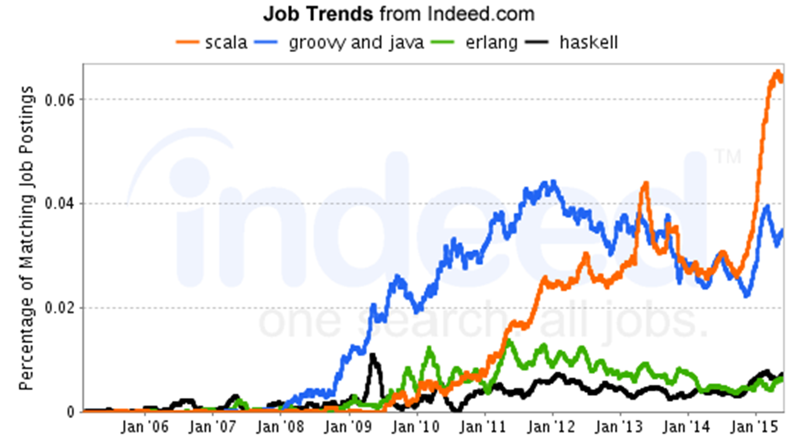

<!-- .slide: data-background="./images/bg-1.png" -->
# Introduction To Scala
Scala is a general purpose programming language, multiparadigm object oriented, functional, scalable

* Aimed to implement common programming patterns in a concise, elegant, and type-safe way

* Supports both object-oriented and functional * programming styles, thus helping programmers to be more  productive

* Publicly released in January 2004 on the JVM platform and a few months later on the .NET platform

---
<!-- .slide: data-background="./images/bg-1.png" -->
## Scala is Statically Typed
* Statically typed language binds the type to a variable for its entire scope
* Dynamically typed languages bind the type to the actual value referenced by a variable .Example : python
* Fully supports Object Oriented Programming
* Everything is an object in Scala
* Unlike Java, Scala does not have primitives
* Supports “static” class members through Singleton Object Concept
* Improved support for OOP through Traits

---
# Job trends


---
# Check your Understanding?
Which Features are supported by Scala?

1. Less error prone functional style
2. High maintainability and productivity
3. High scalability
4. High testability
5. Provides features of concurrent programming

---
# Software Installation
Latest version can be downloaded from: [http://www.scala-lang.org/download/]()

Install the Scala and Set the Scala Path in Machine

---
# Scala Hello World
* In your command prompt type ```scala```
* Type
```scala
println("Hello World")
```
---
# Scala IDE
* Scala IDE provides excellent and enhanced editing and debugging support for the development of pure Scala  (mixed Scala-Java also) applications

The best choices for Scala IDEs are IntelliJ IDEA and Eclipse because they are excellent in terms of stability and  features like type interference,code inspection and memory consumption

---
# REPL : Read - Evaluate - Print - Loop
* Easiest way to get started with Scala, acts as an interactive shell interpreter
* Even though it appears as interpreter, all typed code is converted to Bytecode and executed

---
# Check your Understanding
* Scala REPL acts as scala Interpreter ?

    1. True
    2. False

* Scala supports primitive and wrapper classes ?
    1. True
    2. False


