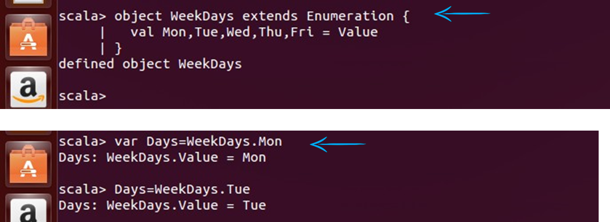

# Pattern Matching
---
Scala has a built-in general pattern matching mechanism
It allows to match on any sort of data with a first-match policy
---

---
*   Here is a second example which matches a value against patterns of different types:

---
## Enumeration
*   Enumeration allows programmer to define their own data type
*   Often we have a variable that can take one of several values. For instance, a WeekDays field of an object could be  either Mon, Tue, Wed, or Thu

---
### Enumeration (cont'd)
*   Another way

*   Gives Error if value is not found

