# Scala Collections
---
Scala has a rich set of collection library
* Collections are containers that hold objects
* Those containers can be sequenced, linear sets of items like Arrays, List, Tuple, Option, Map, etc


---
Collections can be mutable and immutable
Scala collections systematically distinguish between mutable and immutable collections  Mutable collection:

*   A mutable collection can be updated or extended in place
*   This means you can change, add, or remove elements of a collection as a side effect 
*   Immutable collections: By contrast, never change
*   You have still operations that simulate additions, removals, or updates, but those operations will in each case return  a new collection and leave the old collection unchanged
---
## Scala Collections: Array
Arrays are mutable, indexed collections of values.
Array[T] is Scala's representation for Java's T[]
### Declaring Arrays
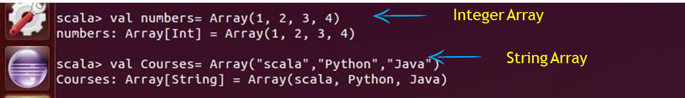
---
### Accessing Arrays
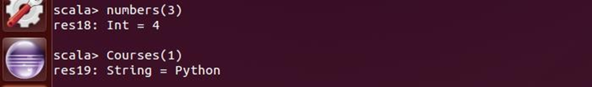
---
Fixed Length Arrays:
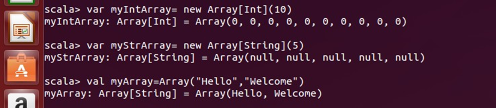
---
*   An ArrayBuffer buffer holds an array and a size. Most operations on an array buffer have the same speed as for an array,  because the operations simply access and modify the underlying array
*   Array buffers can have data efficiently added to the end

---
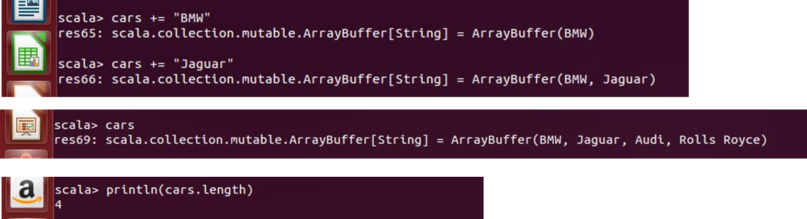
---
#### ArrayBuffers (cont’d)
*   cars.trimEnd(1) : Removes the last Element
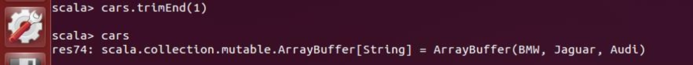
*   Adds element at 2nd index
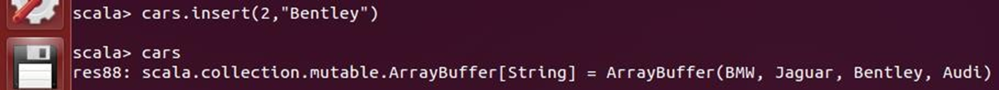
---
# Exercise 
---
## Maps
*   A Map is a collection of key/value pairs
*   Any value can be retrieved based on its key
*   Keys are unique in the Map, but values need not be unique
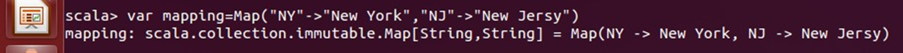
---
*   Accessing immutable Maps:

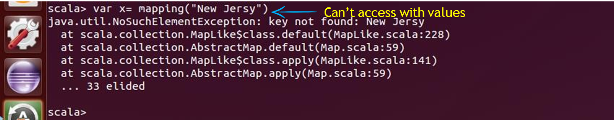
---
### Default Values
*   If there is a sensible default value for any key that might try with map, it can use the getOrElse method
*   it provides the key as the first argument, and then the default value as the second
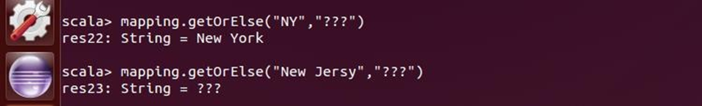

---
## Mutable Maps
*   To create a mutable Map, import it first:

*   Create a map with initial elements
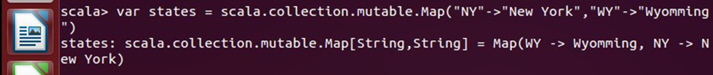
*   add elements with +=
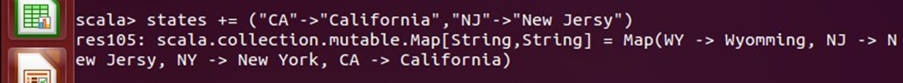
---
## Mutable Maps
*   remove elements with -=
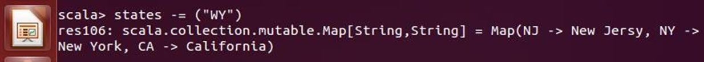
*   Update elements by reassigning them

---
# Exercise 
---
## Tuples
*   A tuple is an ordered container of two or more values of same or different types.
*   Unlike lists and arrays, however, there is no way to iterate through elements in a tuple.
*   Its purpose is only as a container for more than one value
---
### Tuples (cont'd)
*   You create a tuple with the following syntax, enclosing its elements in parentheses.

*   Accessing the tuple elements. (_In tuples the offset starts with 1 and NOT from 0_)
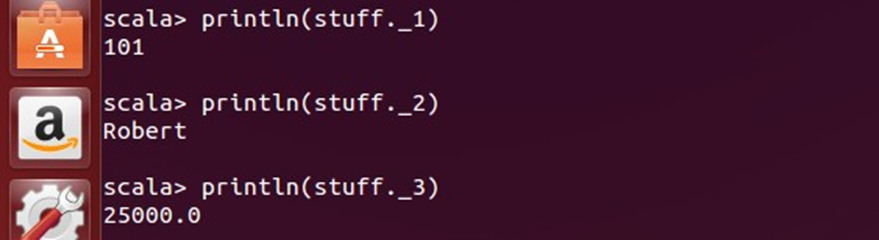
---
### Tuples (cont'd)
Tuples are typically used for the functions which return more than one value:
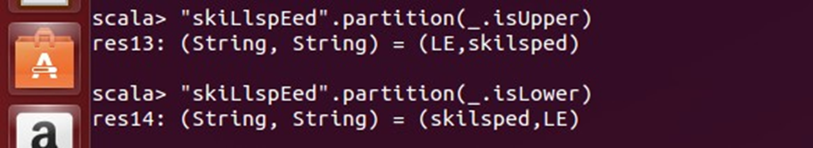
---
## Lists
*   Lists are quite similar to arrays, but there are two important differences.  
*   First, lists are immutable. i.e., elements of a list cannot be changed .
*   Second , lists have a recursive structure whereas arrays are flat.
*   Class for immutable linked lists representing ordered collections of elements of type
    *   This class comes with two implementing case classes scala.Nil and scala.:: that implement the abstract members is
Empty, head and tail
---
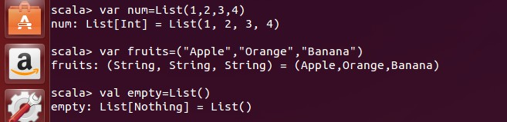


---
## Check your Understanding
*   What is the output of the following?
```scala
val new = List(1,2,3,4) the new._2
```
1.  3
2.  Error
3.  2
4.  None of these


