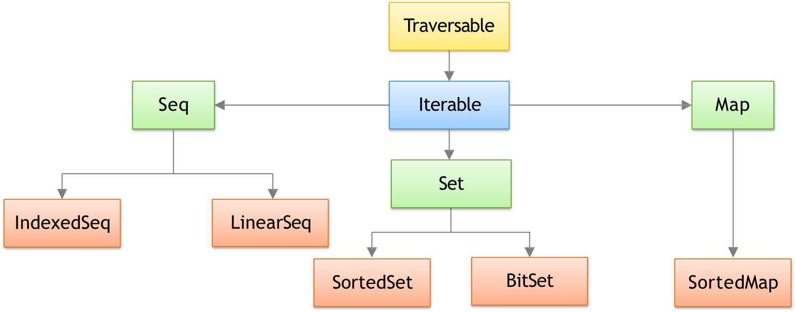

# Scala Collections
---
Scala has a rich set of collection library
* Collections are containers that hold objects
* Those containers can be sequenced, linear sets of items like Arrays, List, Tuple, Option, Map, etc
