<!-- .slide: data-background="./images/bg-1.png" -->
# Scala Essentials
---
## Data Types in Scala
* A Data type tells the compiler about the type of the value to be stored in a location
* Scala comes with the following built-in data types which you can use for your Scala variables
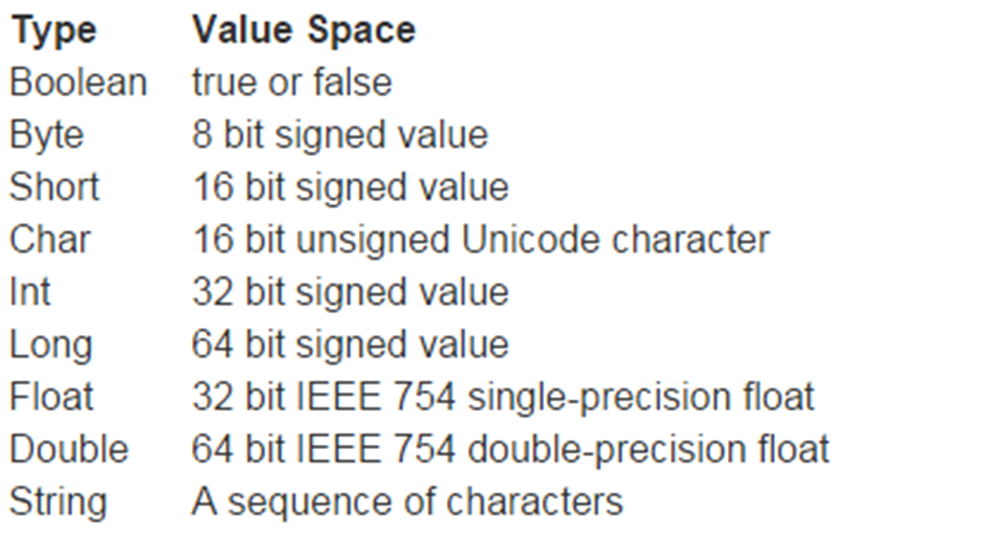
---
#### Data Types in Scala (cont’d)
Few examples
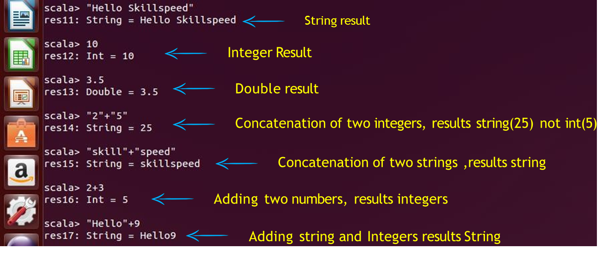

---
## Variables Types in Scala
Variables are simply names used to refer to some location in memory – a location that holds a value with which we
are working

Scala variables come in two shapes: Values and Variables
---
## Values

Values:
Immutable - “val” (Read only)

* Similar to Java Final Variables
* Once initialized, Vals can’t be reassigned
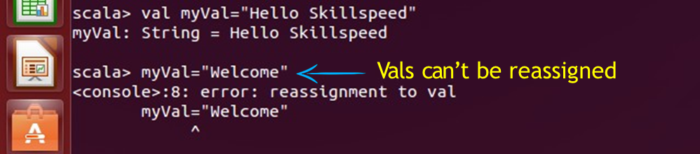
---
### Variables:
Mutable - “var” (Read-write) - Similar to non-final variables in Java

Here, myVar is declared using the keyword var. This means that it is a variable that can change value and this is called  mutable variable

---
#### Type Inference :
When you assign an initial value to a variable, the Scala compiler can figure out the type of the variable based on the  value assigned to it
This is called type inference
Once a type is assigned to a variable, it remains same for entire scope
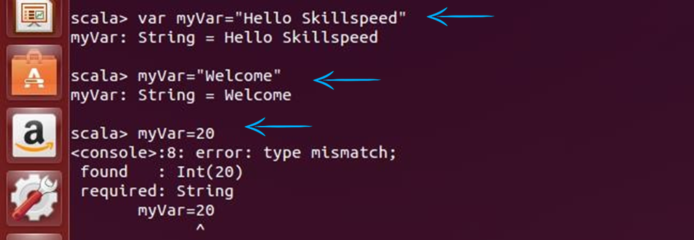

_**Thus, Scala is Statically Typed language**_

---
## Assigning Block Expression
* In Java or C++ a code block is a list of statements in curly braces { }
* In Scala, a { } block is a list of expressions, and result is also an expression
* The Value of a block is the value of the last expression of it

---
## Lazy Values
* One nice feature built into Scala are "lazy val" values.
* Lazy value initialization is deferred till it’s accessed for first time
* For example : If you want to read a file abc.txt, if the file is not existing , you will get FileNotFoundException exception
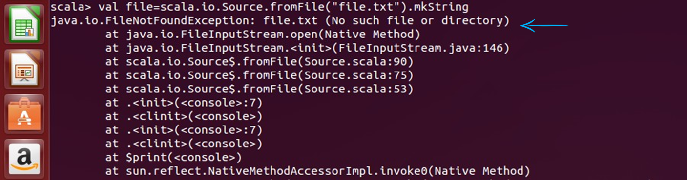
---
##### Lazy Values (cont'd)
* But if you initialize the value as Lazy, you won’t get this error, because it will delay the initialization till it accesses  the file abc.txt


* Lazy values are very useful for delaying costly initialization instructions
* Lazy values don’t give error on initialization, whereas no lazy value do give error

---
## Check your Understanding
If ``` val a = (1, 2, 4,11, "Robert",5,9,11,2.5 ) ``` then ```a._5```?

1. No value , its wrong syntax
2. 5
3. Nil
4. "Robert"

---
## Control Structures in Scala
* Control Structures controls the flow of execution
* Scala provides various tools to control the flow of program’s
execution
* Some of them are
```scala
if..else
while
do-while
foreach
for
```
---
#### Control Structures in Scala (cont’d): if-else
An if statement can be followed by an optional else statement, which executes  when the boolean expression is false.
* if-else syntax in Scala is same as Java or C++
* In Scala, if-else has a value, of the expression following it
* Semicolons are optional in Scala

---
#### Control Structures in Scala (cont’d): if-else
Every expression in Scala has a type. First If statement has a type Int
Second statement has a type Any. Type of a mixed expression is supertype of both branches


---
#### Control Structures in Scala (cont’d): while loop
* A while loop statement repeatedly executes a target statement as long as a given condition is true
* In Scala while and do-while loops are same as Java
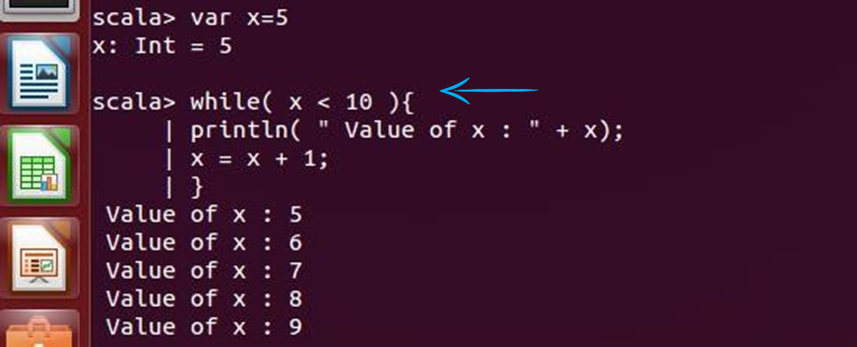
---
#### Control Structures in Scala (cont’d): do- While Loop
A do...while loop is similar to a while loop, except that a do...while loop is guaranteed to execute at least one time
Syntax:
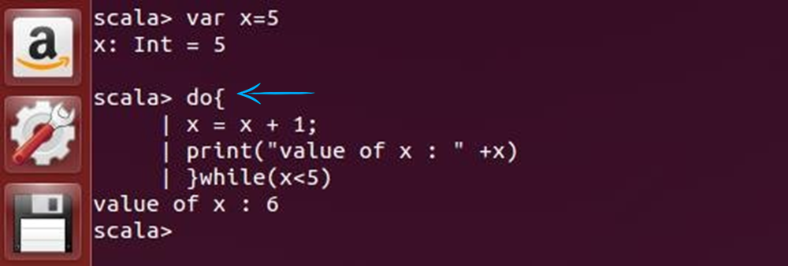
---
#### Control Structures in Scala (cont’d): foreach Loop

---
#### Control Structures in Scala (cont’d): foreach Loop with function

---
#### Control Structures in Scala (cont’d): for loop
for loop can execute a block of code for specific number of times.
Scala doesn’t have for (initialize; test; update) syntax
```scala
for( var x <- n ) {
//Block of statements;
}
```
---
#### Scala: For Loop : to vs. until
You can use either the keyword to or until when creating a Range object. The difference is, that to includes the last  value in the range, whereas until leaves it out. Here are two examples:
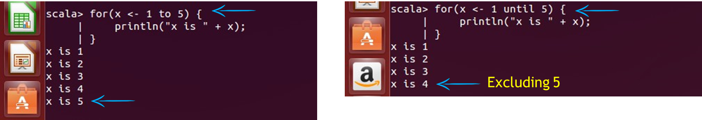
---
## Check your Understanding
What is the output of the following program?
```
for (x <- 'a' until 'f')
print(x)
```
1. Error
2. abcde
3. abcdef
4. None of these

---
#### Control Structures in Scala: for Loop (cont’d)
Advanced For Loop: can have multiple generators in for loop
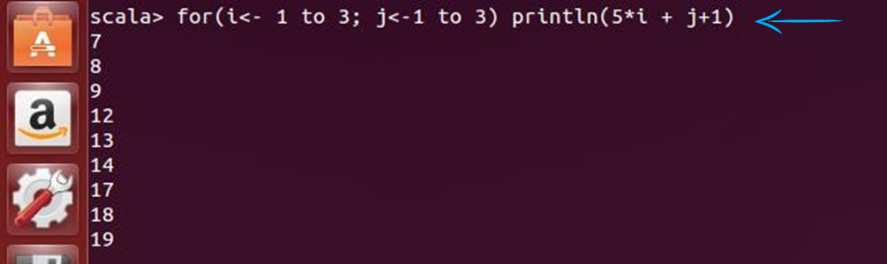

---
#### Control Structures in Scala: for Loop(cont’d)

We can put conditions in multi generators for loop
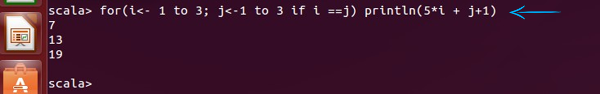

---
#### Control Structures in Scala: for Loop(cont’d)

We can introduce variables in loop!
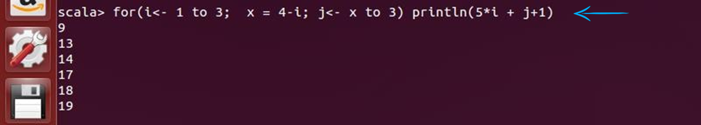

---
#### Control Structures in Scala: The for Loop with Yield
If the body of for loop starts with yield, it returns a collection of values
```scala
val x = for(i<- 1 to 10) yield i*5
```
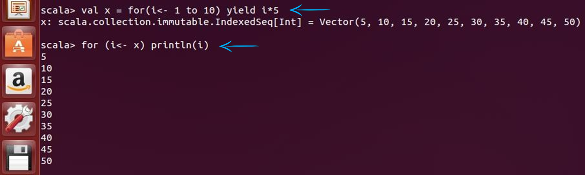
---
## Functions
A function is a group of statements that together perform a task
Scala function is a complete object which can be assigned to a variable
The last statement in the function is the return value.  You can create functions with "def" keyword
```scala
def functionName ([list of parameters]) : [return type] = {
    function body  
    return [expr]
}
```
---
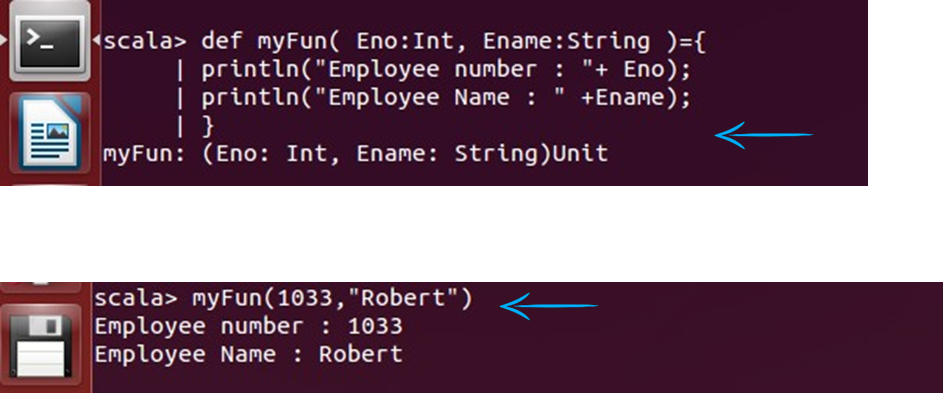
---
#### Functions (cont’d)
We can provide defaults to function arguments, which will be used in case no value is provided in function calls
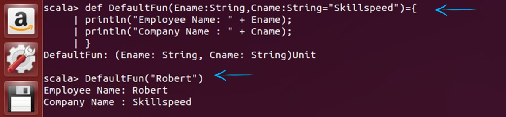

---
#### Functions (cont’d)
* We can specify argument names in function calls
* In named invocations the order of arguments is not necessary
* We can mix unnamed and named arguments, if the unnamed argument is the first one. We can specify argument  names in function calls
* In named invocations the order of arguments is not necessary
* We can mix unnamed and named arguments, if the unnamed argument is the first one
* Scala supports variable number of arguments to a function
---
## Check your Understanding
What is the output of the following?

```scala
def concatStr(a:String, b:Int=2 , c:String) = {a + b + c}
println(concatStr( "Hi",200, "Welcome"))
```

1. Hi2Welocme
2. Hi200Welcome
3. Error
4. Hi2200Welcome

